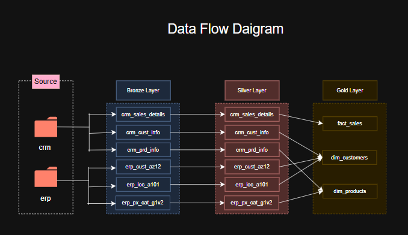
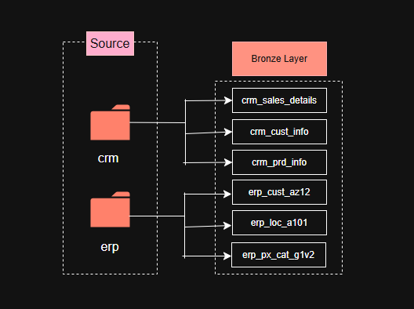
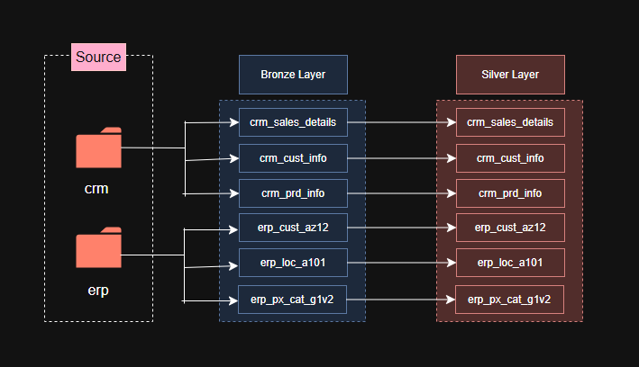
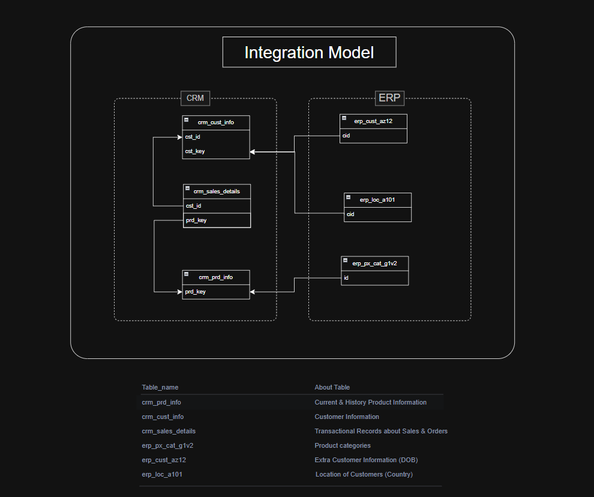
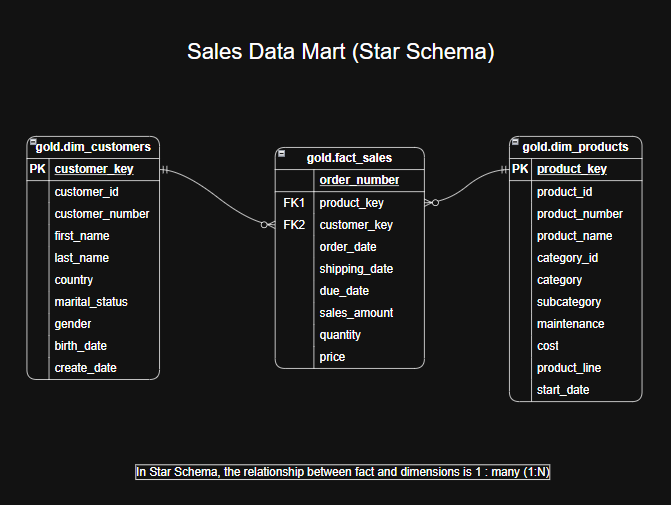

# Data Warehouse and Analytics Project

Welcome to the **Data Warehouse and Analytics Project** repository! 🚀
This project demonstrates a comprehensive data warehousing and analytics solution, from building a data warehouse to generating actionable insights. Designed as a portfolio project, it highlights industry best practices in data engineering and analytics.

---
## 🏗️ Data Architecture

The data architecture for this project follows Medallion Architecture **Bronze**, **Silver**, and **Gold** layers:


1. **Bronze Layer**: Stores raw data as-is from the source systems. Data is ingested from CSV files (CRM & ERP) into SQL Server Database tables.
2. **Silver Layer**: This layer includes data cleansing, standardization, and normalization processes to prepare data for analysis.
3. **Gold Layer**: Houses business-ready data modeled into a star schema required for reporting and analytics.

---
## 📖 Project Overview

This project involves:

1. **Data Architecture**: Designing a Modern Data Warehouse Using Medallion Architecture **Bronze**, **Silver**, and **Gold** layers.
2. **ETL Pipelines**: Extracting, transforming, and loading data from source systems into the warehouse.
3. **Data Modeling**: Developing fact and dimension tables optimized for analytical queries.
4. **Analytics & Reporting**: Creating SQL-based reports for actionable insights.

🎯 This repository is an excellent resource for professionals and students looking to showcase expertise in:
- SQL Development
- Data Architect
- Data Engineering
- ETL Pipeline Developer
- Data Modeling
- Data Analytics

---
## 🔄 Data Flow

Data moves from source flat files through Bronze and Silver, before being remodeled into the Gold layer.

**Source → Bronze**: Raw CRM and ERP files are loaded 1:1 into Bronze tables with no transformation applied.


**Bronze → Silver**: Each table is cleansed, standardized, and de-duplicated before being loaded into its Silver counterpart.   


---
## 🔗 Integration Model

CRM and ERP are independent source systems, so keys must be mapped across them to integrate the data correctly (e.g., `cst_key` ↔ `cid`, `prd_key` ↔ `id`).



| Table_name | About Table |
|---|---|
| crm_prd_info | Current & History Product Information |
| crm_cust_info | Customer Information |
| crm_sales_details | Transactional Records about Sales & Orders |
| erp_px_cat_g1v2 | Product categories |
| erp_cust_az12 | Extra Customer Information (DOB) |
| erp_loc_a101 | Location of Customers (Country) |

---
## ⭐ Data Model (Star Schema)

The Gold layer is modeled as a Star Schema — `gold.fact_sales` connects to `gold.dim_customers` and `gold.dim_products`, with a 1:many relationship between each dimension and the fact table.



---
## 🛠️ Important Links & Tools:

Everything is for Free!
- **[Datasets](datasets/):** Access to the project dataset (csv files).
- **[PostgreSQL](https://www.postgresql.org/download/):** Lightweight server for hosting your SQL database.
- **pgAdmin:** GUI for managing and interacting with databases.
- **[Git Repository](https://github.com/aman-theanalyst/sql-data-warehouse-project):** This repository — manage, version, and collaborate on the code.
- **[DrawIO](https://www.drawio.com/):** Design data architecture, models, flows, and diagrams.

---
## 🚀 Project Requirements

### Building the Data Warehouse (Data Engineering)

#### Objective
Develop a modern data warehouse using SQL Server to consolidate sales data, enabling analytical reporting and informed decision-making.

#### Specifications
- **Data Sources**: Import data from two source systems (ERP and CRM) provided as CSV files.
- **Data Quality**: Cleanse and resolve data quality issues prior to analysis.
- **Integration**: Combine both sources into a single, user-friendly data model designed for analytical queries.
- **Scope**: Focus on the latest dataset only; historization of data is not required.
- **Documentation**: Provide clear documentation of the data model to support both business stakeholders and analytics teams.


## 📂 Repository Structure
```
sql-data-warehouse-project/
│
├── datasets/                           # Raw datasets used for the project (ERP and CRM data)
│
├── docs/                               # Project documentation and architecture details
│   ├── Data_Flow-Bronze_Layer.png
|   ├── Data_Flow-Silver_Layer.png
│   ├── Data_Flow_Diagram.png      
│   ├── ETL_Process.png                  
│   ├── Relationships_btw_Tables.png
│   ├── Star_Schema.png              
|   ├── data_catalog.md
│   ├── naming-conventions.md          
│
├── scripts/                            # SQL scripts for ETL and transformations
│   ├── bronze/                         # Scripts for extracting and loading raw data
│   ├── silver/                         # Scripts for cleaning and transforming data
│   ├── gold/                           # Scripts for creating analytical models
│
├── tests/                              # Test scripts and quality files
│
├── README.md                           # Project overview and instructions
├── LICENSE                             # License information for the repository
└── .gitignore                          # Files and directories to be ignored by Git
```

---
## 🛡️ License

This project is licensed under the [MIT License](LICENSE). You are free to use, modify, and share this project with proper attribution.

## 🌟 About Me

Hi there! I'm **Aman**, and this is my portfolio project exploring modern data warehousing on Postgre SQL.

Feel free to connect, fork the repo, or open an issue with suggestions.

